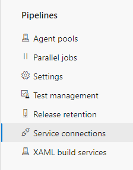
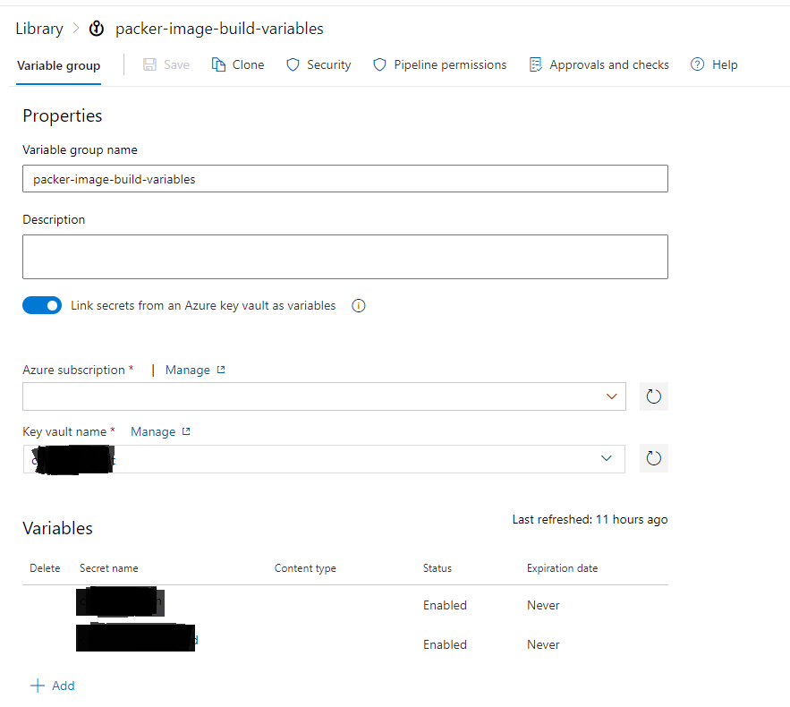
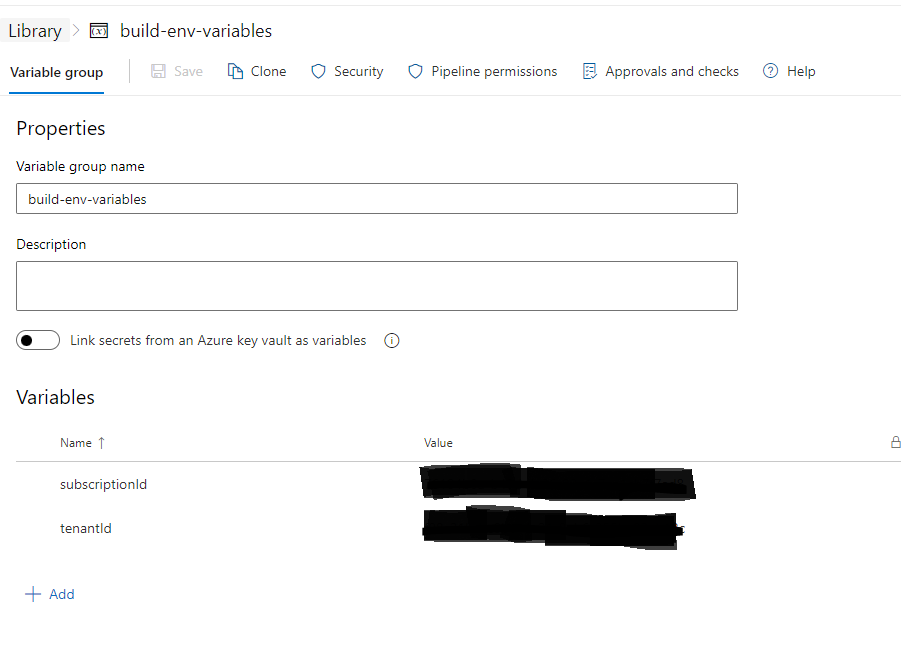
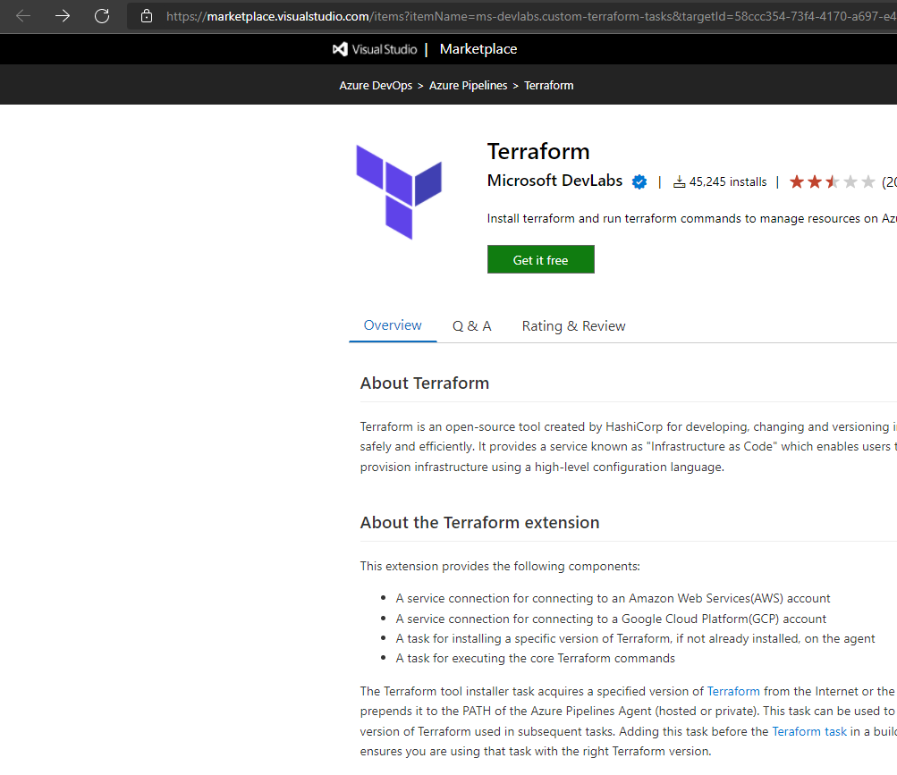
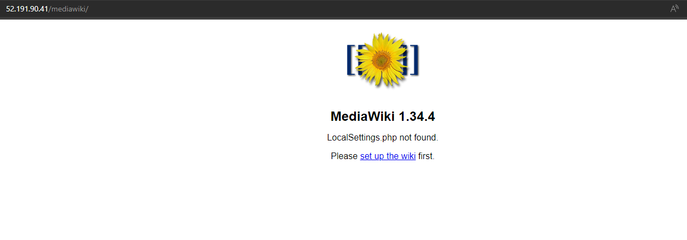

# Deployment of Mediawiki

## Deployment Set Up

### Set pipeline to build image using packer

1. Install Packer extension from marketplace.

    

2. Create Service connection for Azure Resource Manager.

    

3. Create variable group *packer-image-build-variables* to fetch secrets from key vault. Make sure to create key vault and save service principal credentials.

    

4. Create variable group *build-env-variables* and add subscriptionId and tenantId.

    

5. Edit *mediawiki.pkr.hcl* file and add image name and resource group where image is deployed.

6. Create pipeline in Azure DevOps.

7. Run pipeline

8. Grant permission for pipeline to access variable groups

---

## Set pipeline to deploy resources in Azure

1. Install Terraform extension from Visual Studio marketplace.

    

2. Create pipeline.

3. Update variables in *deployment.auto.tfvars* file.

4. Edit *infra-pipeline.yaml* with storage account name for storing tfstate file. Update service connection in the same file.

5. Run pipeline.

## Login to server

1. Add key vault access policy to allow access to fetch secrects.

2. Download private key. Key is in `.pem` format.

3. SSH to server with client of your choice.

4. Set up database user.

## Access Mediawiki

1. Get public ip of the VM from Azure Portal.

2. Mediawiki site is hosted on `http://<public ip>/mediawiki/`

    
